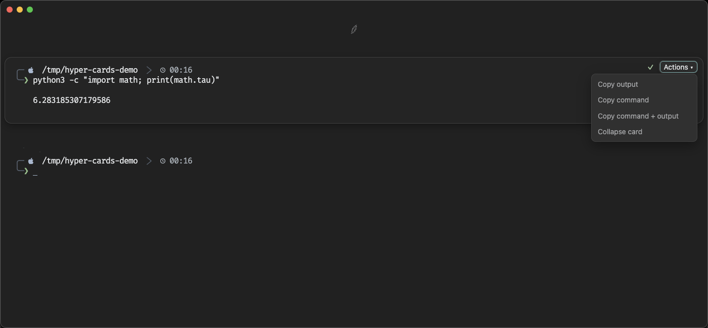
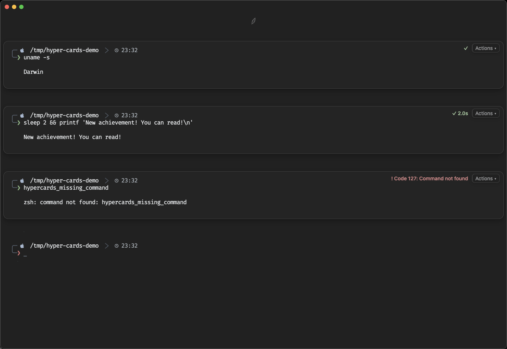
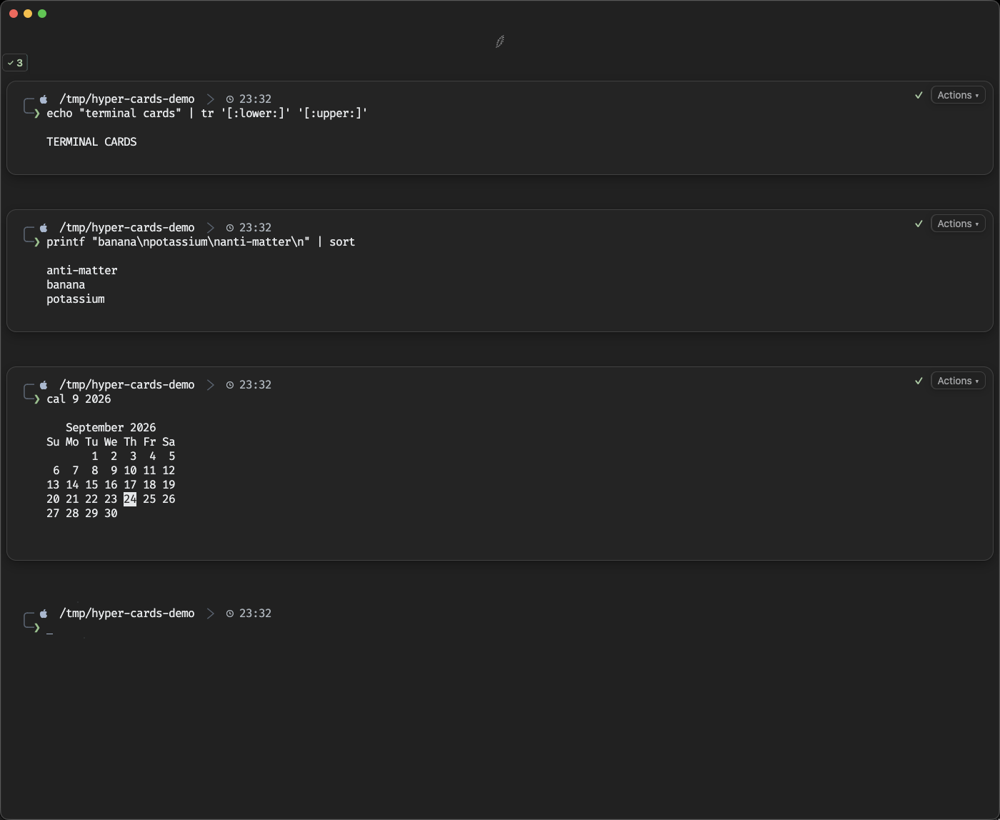
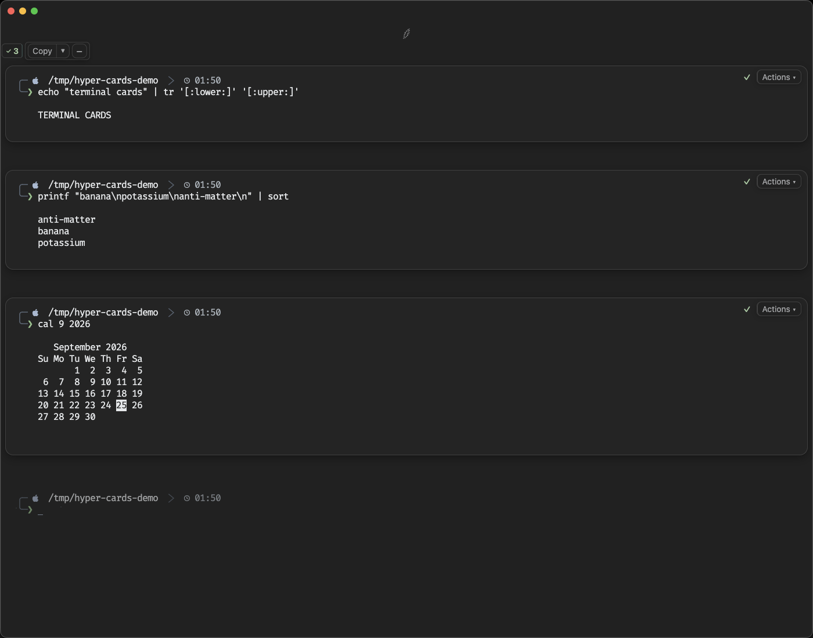
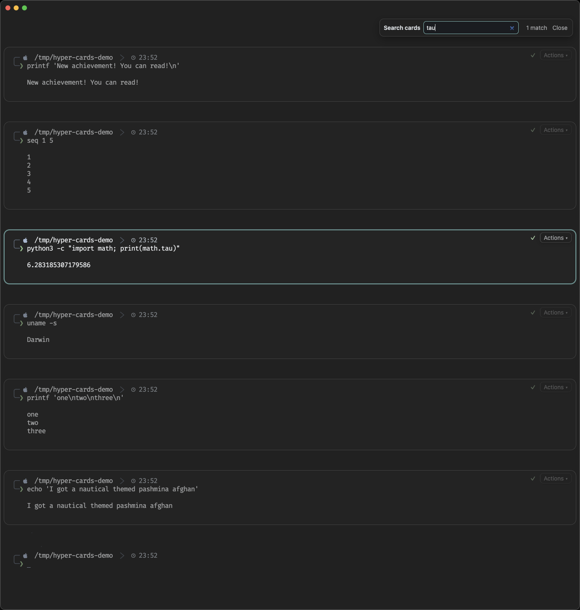
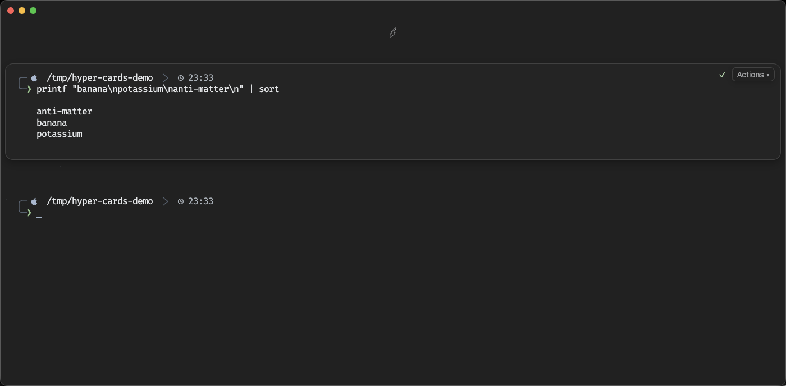

# Hyper Cards

[](LICENSE)
[](#requirements)
[](https://hyper.is)
[](https://www.zsh.org/)
[](https://github.com/drabhikroy/HyperCards/releases)

Hyper Cards turns terminal commands and their output into separate visual cards inside [Hyper](https://hyper.is).

Each command stays connected to its output, making long terminal sessions easier to scan, copy, collapse, and revisit.


> **Current scope**
>
> Hyper Cards is currently built and tested on macOS with Hyper and zsh.

## Features

- Places each completed command and its output in a separate card
- Shows a compact command result and elapsed time when available
- Keeps regular card actions in one **Actions** menu
- Searches commands and output from the current terminal session
- Selects multiple cards and copies their output, commands, or both in terminal order
- Groups commands from the same multiline paste into a numbered batch with shared controls
- Marks completed batches with success or failure symbols
- Makes a batch easier to identify when its tab is hovered or focused
- Starts output beneath the command text rather than beneath the prompt
- Collapses output and reclaims the terminal rows it occupied
- Restores collapsed output when needed
- Removes cards when the terminal is cleared
- Handles pasted groups of independent commands one at a time
- Adds searchable command history through fzf
- Keeps standard `Ctrl+R` history access available
- Adds configurable Mac shortcuts for history and card search
- Includes matching Hyper and Starship presets
- Supports keyboard navigation within menus and card controls
- Uses text and symbols rather than color alone to communicate controls and state

## Card controls

Each completed card shows its result and an **Actions ▾** control in the upper-right corner.

The Actions menu includes:

- Copy output
- Copy command
- Copy command + output
- Collapse card or Expand card



Collapsed cards remove their output rows from the visible terminal rather than simply hiding them.


The Hyper Cards button near the top of the terminal opens session-wide controls:

- Search cards
- Select cards or Stop selecting
- Collapse all or Expand all

The wording changes when the current state changes. For example, **Collapse all** becomes **Expand all** when every visible card is collapsed.

## Command results

Completed cards show a compact result beside the Actions control. Longer-running commands also show elapsed time.

Examples include:

```text
✓
✓ 2.0s
! Code 1: Command reported an error
! Code 127: Command not found
! Code 130: Interrupted with Ctrl+C
```

Common nonzero exit codes receive short descriptions. Other nonzero codes still show the code and a general failure description.



## Multi-card copy

Multiple cards can be selected and copied together without combining them manually.

Open the Hyper Cards menu and choose **Select cards**. Selection controls then appear on the cards in the current session.

Choose the `○` control on each card you want to include. Selected cards are marked with `✓`, and a compact control bar shows the number of selected cards.


The bulk Copy menu provides the same three copy choices as an individual card:

- Copy output
- Copy command
- Copy command + output

Selected cards are copied in their original terminal order, regardless of the order in which they were selected.

A successful bulk copy clears the selection. **Cancel**, **Stop selecting**, or `Esc` exits selection mode without copying.

## Command batches

When several independent commands are pasted together, Hyper Cards keeps each command in its own card and marks the related cards as one batch.

A compact batch tab sits beside the first card in the batch. It begins with the number of commands in the batch.

- `! N` appears as soon as any command in the batch returns a nonzero exit code
- `✓ N` appears after every command in the batch completes successfully



Hover over or move keyboard focus to the batch tab to reveal its batch controls and make the related batch easier to identify.



Batch copying can copy output, commands, or commands with output. Each command still remains a normal Hyper Card with its own Actions menu.

## Keyboard access

Hyper Cards controls can be used from the keyboard once focus moves into them.

- `Tab` moves forward through controls
- `Shift+Tab` moves backward
- `Enter` or `Space` activates the selected control
- Arrow keys move through menus
- `Home` and `End` jump within a menu
- `⌘⇧F` opens current-session card search
- `Esc` closes card search, clears an active multi-card selection, or returns focus to the terminal

No default shortcut is assigned for moving focus directly into card controls. This avoids taking over another commonly used Hyper or macOS shortcut.

## Card search

Press `⌘⇧F` or choose **Search cards** from the Hyper Cards menu to search cards from the current terminal session.

The search checks command text and captured output as you type. Matching cards remain at full strength while nonmatching cards are visually reduced.



The count beside the search field reports the number of matches. With an empty search field, it reports the number of cards in the current session.

Choose **Close** or press `Esc` to leave search. Closing search does not remove or change any cards.

`⌘F` remains available for Hyper's normal terminal search.

## Command history

Hyper Cards adds a Mac history shortcut while keeping the standard terminal shortcut available.


| Shortcut | Action |
| --- | --- |
| `⌘R` | Open command history |
| `⌘R` again | Close command history |
| `Esc` | Close command history |
| `Ctrl+R` | Open history with the standard zsh/fzf shortcut |
| `Enter` | Place the selected command at the prompt |

> **Important**
>
> `Ctrl+R` is not a toggle. Pressing it again does not close the history window. Use `Esc` to close history opened with `Ctrl+R`.

### Changing the history shortcut

`⌘R` is the default Hyper Cards shortcut, but it can be changed without editing the plugin.

Add a custom binding to the `keymaps` section of `~/.hyper.js`.

```js
keymaps: {
  "hyper-command-cards:history": "command+e",
},
```

In this example, `⌘E` replaces `⌘R`.

A user-defined Hyper binding takes precedence over the Hyper Cards default. Removing the custom entry restores `⌘R`.

The standard `Ctrl+R` zsh/fzf shortcut is separate and remains available regardless of the Hyper Cards binding.

## Multiline paste

Hyper Cards can process several independent shell commands pasted at the same time.

For example:

```sh
printf 'one\n'
printf 'two\n'
printf 'three\n'
```

The shell module checks whether each nonblank line is valid zsh syntax on its own.

If it is, the commands are queued and sent one at a time as each new prompt becomes ready.

Commands queued from the same paste are marked as one batch. Each command still keeps its own card and controls.

Some shell structures naturally span several lines. Heredocs are one example.

In those cases, zsh may display continuation marks after the text is pasted. Press Enter once after the complete block has been entered.

## Long output

Cards can span many terminal rows while staying connected to the command that produced them.


Card placement and controls remain connected to the correct output while the terminal scrolls.

Hyper Cards also measures the visible width of the final prompt line before a command starts. Output then begins beneath the command text instead of beneath the prompt.



## Clearing the terminal

Hyper Cards recognizes a full terminal clear and removes its card overlays and markers along with the terminal contents.

For example:

```sh
clear
```

After the clear completes, no card panels or controls should remain.

New commands continue creating cards normally afterward.

## Requirements

### Required

- macOS
- [Hyper](https://hyper.is)
- [zsh](https://www.zsh.org/)

### Recommended

- [Starship](https://starship.rs/) for the supplied prompt preset
- [fzf](https://github.com/junegunn/fzf) for searchable command history
- The included modified [FiraCode Nerd Font Mono](https://github.com/ryanoasis/nerd-fonts/tree/master/patched-fonts/FiraCode) for the intended prompt appearance

The card system does not depend on Starship.

If fzf is not installed, the shell module falls back to the standard zsh reverse history search.

## Installation

Hyper Cards uses two pieces from the same installation folder:

- a local Hyper plugin
- a zsh module

For a new installation, create Hyper's local-plugin directory and clone Hyper Cards directly into it:

```sh
mkdir -p "$HOME/.hyper_plugins/local"

git clone https://github.com/drabhikroy/HyperCards.git \
  "$HOME/.hyper_plugins/local/hyper-command-cards"
```

Open `~/.hyper.js` and add Hyper Cards to `localPlugins`:

```js
localPlugins: [
  "hyper-command-cards"
]
```

Hyper Cards belongs in `localPlugins`, not the normal `plugins` array.

Then add the shell module to `~/.zshrc`:

```sh
source "$HOME/.hyper_plugins/local/hyper-command-cards/shell/hyper-command-cards.zsh"
```

Quit Hyper completely with `⌘Q`, then reopen it.

Test the installation with:

```sh
printf 'Hyper Cards is working\n'
```

The command and its output should appear together in a card.

To update an existing Git installation:

```sh
cd "$HOME/.hyper_plugins/local/hyper-command-cards"
git pull
```

Restart Hyper after updating.

See [INSTALL.md](INSTALL.md) for the complete setup guide, including existing Hyper configurations, fzf, Starship, the supplied font, appearance settings, verification tests, and troubleshooting.

Back up existing Hyper, zsh, and Starship configuration before making manual changes.

Hyper Cards does not automatically replace an existing Hyper or Starship configuration.

## Included files

The repository contains the plugin, shell module, appearance presets, documentation, screenshots, font files, licensing material, and installation helpers.

```text
HyperCards/
├── index.js
├── package.json
├── README.md
├── INSTALL.md
├── LICENSE
├── NOTICE
├── assets/
│   └── screenshots/
│       ├── actions-menu.png
│       ├── batch-grouping.png
│       ├── batch-spotlight.png
│       ├── card-search.png
│       ├── collapsed-card.png
│       ├── command-status.png
│       ├── history-picker.png
│       ├── hyper-cards-overview.png
│       ├── long-output.png
│       ├── multi-select.png
│       ├── output-alignment.png
│       └── prompt-main.png
├── fonts/
│   ├── FiraCodeNerdFontMonoShort76-Regular.ttf
│   ├── FONT-NOTICE.md
│   ├── NERD-FONTS-LICENSE.txt
│   └── OFL.txt
├── presets/
│   ├── hyper.js
│   └── starship.toml
├── scripts/
└── shell/
    └── hyper-command-cards.zsh
```

## Appearance

The supplied presets use a dark terminal background with restrained borders and clear separation between commands, output, prompt information, and controls.


The Starship preset displays:

- current directory
- Git branch and state
- language runtime when present
- current time
- separate success and error prompt markers

The full directory path remains visible rather than being shortened.

## Modified FiraCode Nerd Font Mono

The supplied prompt uses a modified version of [FiraCode Nerd Font Mono](https://github.com/ryanoasis/nerd-fonts/tree/master/patched-fonts/FiraCode) from [Nerd Fonts](https://www.nerdfonts.com/).

For this project, the modified font is referred to as **Short76**. Short76 is not an official Nerd Fonts typeface or family name.

The modification shortens the Powerline separator glyph at U+E0B1 vertically so it sits more naturally beside the surrounding prompt text.

The included font is based on Fira Code 6.002 with Nerd Fonts 3.0.2.

The font remains under the SIL Open Font License 1.1. The applicable license and copyright notices are included in the `fonts` folder.

See:

- [`FONT-NOTICE.md`](fonts/FONT-NOTICE.md) for information about the modification
- [`OFL.txt`](fonts/OFL.txt) for the Fira Code license
- [`NERD-FONTS-LICENSE.txt`](fonts/NERD-FONTS-LICENSE.txt) for Nerd Fonts licensing information

## Hyper configuration

`presets/hyper.js` is a reference configuration.

It is not meant to replace an existing `~/.hyper.js` automatically.

People with an existing Hyper setup can compare the preset with their current configuration and copy only the sections they want.

### Hyper Cards UI text size

Hyper Cards uses a 10.5px base UI text size unless an explicit size is set.

To set a separate size, add this rule inside the existing `css` setting in `~/.hyper.js`:

```css
.hyper-command-cards-root {
  --hcc-user-ui-font-size: 14px;
}
```

`14px` is an example rather than a required value. Hyper Cards accepts values from `9px` through `24px`.

## Starship configuration

`presets/starship.toml` contains the matching prompt configuration used during development and testing.

People with an existing Starship setup can copy the sections they want rather than replacing their current configuration.

## Tested behavior

The following have been tested on macOS:

- card creation
- per-card Actions menu
- output, command, and command + output copying
- command success and failure results
- elapsed-time display
- common exit-code descriptions
- multi-card selection mode
- bulk output copying
- bulk command copying
- bulk command + output copying
- terminal-order copying when cards are selected out of order
- selection clearing with Cancel and `Esc`
- session-wide Collapse all and Expand all
- current-session card search
- `⌘⇧F` card-search shortcut
- search match counts
- card-search close with `Esc`
- command batch creation from multiline pastes
- batch-level output copying
- batch-level command copying
- batch-level command + output copying
- batch success and failure states
- batch-tab hover and keyboard focus behavior
- batch positioning while terminal content moves
- multiple batches in the same session
- card collapse and restore
- terminal-row reclamation after collapse
- long-output scrolling
- output starting beneath command text
- multiline command queuing
- full terminal clear with no card remnants
- new card creation after a clear
- searchable history
- `⌘R` history open and close
- custom Hyper history shortcut overrides
- `Ctrl+R` history access
- `Esc` history close
- keyboard navigation within controls and menus

## Screenshots and privacy

The screenshots in this repository were reviewed before publication for visible personal information and sensitive strings. Nonessential PNG metadata was removed from the final images.

They use example terminal content and document how Hyper Cards looks and behaves. Appearance may vary with the terminal theme, font, shell configuration, and Starship settings.

## License

Hyper Cards is licensed under the [PolyForm Noncommercial License 1.0.0](LICENSE).

Personal use, personal study, hobby projects, teaching, academic research, and other noncommercial uses are permitted. The license also permits use by charitable organizations, educational institutions, public research organizations, public safety or health organizations, environmental protection organizations, and government institutions.

Commercial use requires a separate license.

Required Notice: Copyright 2026 Abhik Roy.

Hyper Cards is an independent project made for use with [Hyper](https://hyper.is). Hyper is separate software and is distributed under the MIT License. Hyper's license applies to Hyper and its source code. The PolyForm Noncommercial License applies to the original Hyper Cards software in this repository.

Nothing in the Hyper Cards license changes the terms that apply to Hyper itself.

The modified [FiraCode Nerd Font Mono](https://github.com/ryanoasis/nerd-fonts/tree/master/patched-fonts/FiraCode) included with this project remains under the SIL Open Font License 1.1. Its license and copyright notices are included with the font files.

Other third-party software or assets remain under their respective licenses.
